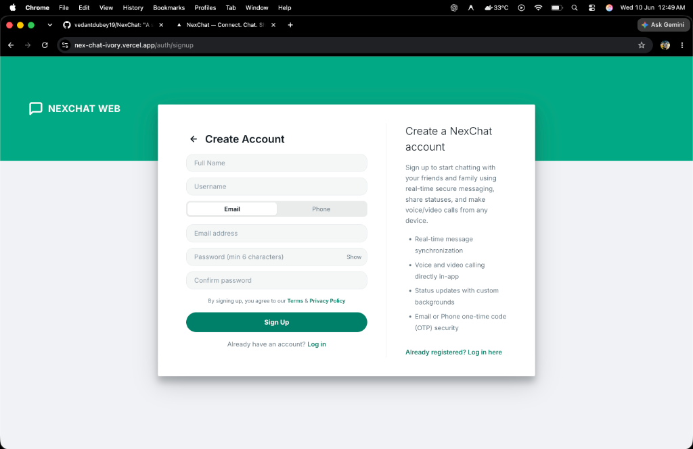

# 🚀 NexChat — Real-Time Messaging & WebRTC Calling Platform

<div align="center">

<h3>A Modern Full-Stack Real-Time Chat Application featuring WebRTC Voice/Video Calls, OTP Security & PostgreSQL</h3>


</div>

## 📸 Screenshots

| Landing Page | Sign Up | Status Feed |
| :---: | :---: | :---: |
|  |  |  |

---

## 📖 Project Overview

**NexChat** is a production-ready, full-stack real-time communication platform designed to replicate the seamless user experience of modern messaging applications like WhatsApp Web. 

Built on a highly optimized architecture, NexChat features instant messaging powered by WebSockets, direct peer-to-peer audio/video calls using WebRTC, and a modern custom design system. It uses a serverless PostgreSQL database (Neon) for secure, scalable state persistence and email onboarding verified through the Resend API.

*Designed with recruiters in mind, this project demonstrates clean MVC backend design, database normalization, custom state management, security best-practices, and complete containerization.*

---

## 📱 Visual Showcase & Live Demo

| Registration & OTP | Chat Dashboard & RTC Calling |
|:---:|:---:|
|  |  |

---

## ✨ Features Showcase

### 💬 Real-Time Instant Messaging
*   **Dynamic Chat Feeds:** Real-time message exchange powered by Socket.IO.
*   **Presence Indicators:** Active state status (`online`, `offline`, or `last seen`).
*   **Typing Indicators:** Visual cues when a user starts typing in a direct or group chat.
*   **Read Receipts:** Step-by-step indicators: Sent (✓), Delivered (✓✓), and Read (Blue ✓✓).
*   **Reactions & Edits:** React to messages with emojis and edit/soft-delete messages dynamically.

### 📞 WebRTC Voice & Video Calling
*   **Peer-to-Peer Media:** Direct high-quality browser-to-browser calls using standard `getUserMedia` APIs.
*   **Signaling Channel:** Node/Socket.IO backend acts as the SDP offer/answer and ICE candidate broker.
*   **STUN Server Integration:** Automatic NAT traversal using Google public STUN servers.

### 🔐 Auth & Enterprise Security
*   **OTP Onboarding:** Two-factor onboarding using secure 6-digit OTP codes sent via the **Resend API**.
*   **JWT Session Manager:** Dual-token rotation scheme utilizing short-lived Access Tokens and secure database-persisted Refresh Tokens.
*   **Security Middleware:** Express server hardened using `helmet`, CORS filters, and `express-rate-limit` to prevent brute-force attacks.

---

## 🛠 Tech Stack

### Frontend
*   **Next.js 16 (App Router):** Fast, React-based server-side rendering framework.
*   **Vanilla CSS Design System:** Modern custom HSL layout system featuring theme presets, custom animations, and responsive grids.
*   **Socket.IO Client:** Persistent full-duplex socket integration.

### Backend
*   **Node.js & Express:** Lightweight, modular REST API and route controller backend.
*   **Socket.IO Server:** Real-time event broker handling room joins, presence, and WebRTC signals.
*   **Multer:** Configured middleware handling multi-part file uploads (supports up to 50MB attachments).

### Database & Integrations
*   **PostgreSQL:** Normalised database structure.
*   **Neon DB:** High-performance, serverless PostgreSQL database provider.
*   **Resend API:** Transactional email OTP dispatcher.

---

## 🏗️ System Architecture & Protocols

### 📡 WebRTC Calling Sequence
The WebRTC protocol routes signaling handshake metadata through the Express Socket.IO server:

```text
 Caller Client                       Signaling Server                     Callee Client
 -------------                       ----------------                      -------------
   getUserMedia()
   POST /calls/initiate ------------> Logs to database
   socket.emit('call:initiate') ----> Socket.IO server -------------> socket.emit('call:incoming')
                                                                       getUserMedia()
                                                                       socket.emit('call:answer')
   socket.emit('call:answered') <----- Relayed <-----------------------
   
   // PeerConnection Negotiation
   createPeerConnection()
   addTrack(localStream)
   createOffer()
   socket.emit('call:offer') --------> Relayed ----------------------> setRemoteDescription(offer)
                                                                       createAnswer()
                                                                       socket.emit('call:answer-sdp')
   socket.emit('call:answer-sdp') <--- Relayed <---------------------
   setRemoteDescription(answer)
   
   // ICE candidate exchanges
   onicecandidate -------------------> Relayed ----------------------> addIceCandidate()
   addIceCandidate() <---------------- Relayed <---------------------- onicecandidate
   
   ========================= P2P MEDIA CHANNEL ESTABLISHED =========================
```

### 🗄️ Database Normalization Schema
```text
                                  +-------------------+
                                  |       users       |<-----------------------+
                                  +-------------------+                        |
                                    |        |      ^                          |
                                    |        |      | (uploader)               |
  +-----------------------+         |        |  +---+------------------+       |
  |     user_settings     |---------+        |  |      user_otps       |       |
  +-----------------------+                  |  +----------------------+       |
                                             v                                 v (viewer)
  +-----------------------+         +------------------+             +--------------------+
  |       contacts        |-------->|      media       |             |   status_viewers   |
  +-----------------------+         +------------------+             +--------------------+
                                             ^                                 |
                                             | (message_id)                    v (status_id)
  +-----------------------+         +------------------+             +--------------------+
  |         chats         |<--------|     messages     |<------------|      statuses      |
  +-----------------------+         +------------------+             +--------------------+
     |                                |              |
     v (chat_id)                      v (message_id) v (message_id)
  +-----------------------+         +----------------+
  |     chat_members      |         | message_status |
  +-----------------------+         +----------------+
                                             |
                                             v
                                    +----------------+
                                    |message_reactions|
                                    +----------------+
```

---

## 📂 Project Structure

```bash
NexChat/
├── Frontend/                  # Next.js web application
│   ├── public/                # Static assets and icons
│   ├── src/
│   │   ├── app/               # Page routing (auth, chat, calls, status)
│   │   ├── components/        # UI layout and interactive components
│   │   ├── context/           # Global Contexts (AuthContext, Theme)
│   │   └── utils/             # Helper libs and API wrappers
│   └── Dockerfile
│
├── Backend/                   # Node/Express API & WebSocket server
│   ├── src/
│   │   ├── config/            # PostgreSQL database client pool
│   │   ├── db/                # schema.sql and initialization scripts
│   │   ├── middleware/        # JWT auth filters & validators
│   │   ├── routes/            # MVC route controllers
│   │   ├── socket/            # Real-time event and signalling handlers
│   │   └── app.js             # Express application configuration
│   └── Dockerfile
│
├── screenshots/               # Showcase screenshots
└── start.sh                   # Docker orchestration startup script
```

---

## 🌐 API Endpoints reference

### 🔐 Authentication (`/api/auth`)
| Method | Endpoint | Description |
|:---|:---|:---|
| `POST` | `/api/auth/register` | Create user profile & dispatch OTP code |
| `POST` | `/api/auth/login` | Check credentials & issue JWT keys |
| `POST` | `/api/auth/verify-otp` | Verify OTP code and activate profile |
| `POST` | `/api/auth/refresh` | Renew expired Access Token using Refresh Token |

### 💬 Conversations (`/api/chats` & `/api/groups`)
| Method | Endpoint | Description |
|:---|:---|:---|
| `GET`  | `/api/chats` | Retrieve user active inbox list |
| `POST` | `/api/chats` | Start direct 1:1 conversation |
| `POST` | `/api/groups` | Initialize new group room |
| `GET`  | `/api/chats/:id/messages` | Fetch chat message logs (paginated) |

### 📞 RTC Calls & Statuses (`/api/calls` & `/api/status`)
| Method | Endpoint | Description |
|:---|:---|:---|
| `POST` | `/api/calls/initiate` | Log starting call entry in database |
| `GET`  | `/api/calls/history` | Retrieve call history list |
| `POST` | `/api/status` | Upload ephemeral story (expires in 24 hours) |

---

## ⚙️ Getting Started

### Prerequisites
*   Node.js (v20+)
*   PostgreSQL 16 database instance (local or hosted on Neon)
*   Resend API Key

### Local Installation
1.  **Clone the Repository:**
    ```bash
    git clone https://github.com/vedantdubey19/NexChat.git
    cd NexChat
    ```
2.  **Setup Backend environment variables:**
    Create `Backend/.env` matching this configuration:
    ```env
    PORT=3001
    DATABASE_URL=postgresql://<user>:<password>@<host>/<database>?sslmode=require
    JWT_SECRET=your_jwt_secret_key
    RESEND_API_KEY=your_resend_api_key
    FRONTEND_URL=http://localhost:3000
    ```
3.  **Setup Frontend environment variables:**
    Create `Frontend/.env.local`:
    ```env
    NEXT_PUBLIC_API_URL=http://localhost:3001/api
    NEXT_PUBLIC_SOCKET_URL=http://localhost:3001
    ```
4.  **Install dependencies and run:**
    *   **Backend:**
        ```bash
        cd Backend && npm install
        npm run dev
        ```
    *   **Frontend:**
        ```bash
        cd Frontend && npm install
        npm run dev
        ```

---

## 🚀 Cloud Deployment

### Frontend (Vercel)
Deploy `Frontend` root directly to Vercel (Next.js preset). Add `NEXT_PUBLIC_API_URL` and `NEXT_PUBLIC_SOCKET_URL` pointing to the backend domain.

### Backend (Render / Railway)
Deploy the `Backend` directory. Render automatically compiles Node.js projects for free web services. Add your database, JWT, and Resend secrets as env variables.

---

## 👨‍💻 Developer & Support

**Vedant Dubey**
*   **GitHub:** [@vedantdubey19](https://github.com/vedantdubey19)
*   **LinkedIn:** [vedantdubey19](https://linkedin.com/in/vedantdubey19)

*If this architecture helped you or you like the code, please drop a ⭐ on [GitHub](https://github.com/vedantdubey19/NexChat)!*
